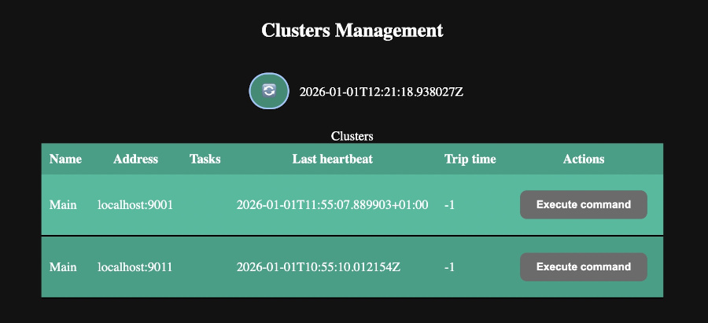

Smart Cluster Project (With management interface)
===

<a id="readme-top"></a>

> This project is still under development. Please wait for the official release.

[](https://github.com/nhn/tui.editor/blob/master/LICENSE)



## 🚩 Table of Contents

- [Features](#-features)
- [Ideas](#-ideas)
- [Built With](#-built-with)
- [How to run](#-how-to-run)
- [Browser Support](#-browser-support)
- [Why this project?](#-why-this-project)
- [License](#-license)


<p align="right">(<a href="#readme-top">back to top</a>)</p>

## 🎨 Features

* Possibility to declare multiple clusters.
* CLI and LanguageExpression runtimes are supported for both local and remote execution.
* Heartbeats and self-connection detection.
* WebSocket Long Pooling for UI Synchronization.

<p align="right">(<a href="#readme-top">back to top</a>)</p>

## 💡 Ideas

* Deadliness detector—when x node hasn't sent heartbeat for 10 cycles, then remove it from the cluster.
* Task splitter—split one heavy task into multiple smaller and delegate.
* Pocket fragmentation—send support bigger data chunks for larger clusters.
* Possibility to create and shutdown nodes on demand.

<p align="right">(<a href="#readme-top">back to top</a>)</p>

## ⚙️ Built With

* [![Java][Java]][OpenJDK25-url]
* [![JavaScript][JavaScript]][TC39-url] 

<p align="right">(<a href="#readme-top">back to top</a>)</p>

## 🐾 How to run

Beforehand, enter to the `test` directory and install all packages using the following command:

```shell
mvn clean install
```

and then run

```shell
mvn clean package
```

or if you want to skip source code and tests:

```shell
mvn clean verify -DskipTests # or mvn clean verify -Dmaven.test.skip=true -Dmaven.main.skip=true
```

In the development phase, you can run the project using the following command:

```shell
CONFIG_FILE=src/test/kit/config_main.json  mvn -q exec:java -Dexec.mainClass=org.sample.App -e
```

This will create one node, if you want to create another one, you can use:

````shell
CONFIG_FILE=src/test/kit/config_secondary.json  mvn -q exec:java -Dexec.mainClass=org.sample.App -e
````

To run one node after generating an uber JAR, please use the following command:

```shell
CONFIG_FILE=src/test/kit/config_main.json java -jar target/node-cluster.jar
```

<p align="right">(<a href="#readme-top">back to top</a>)</p>

## 🌏 Browser Support

|  Chrome/<br/> Chromium based |  Internet Explorer |  Edge |  Safari |  Firefox |
|:-------------------------------------------------------------------------------------------------------------------------------------------------------------------------------------:|:-----------------------------------------------------------------------------------------------------------------------------------------------------------------------:|:------------------------------------------------------------------------------------------------------------------------------------------------------------:|:----------------------------------------------------------------------------------------------------------------------------------------------------------------:|:------------------------------------------------------------------------------------------------------------------------------------------------------------------:|
|                                                                              Yes - Latest version tested                                                                              |                                                                              Not supported                                                                              |                                                                        Not supported                                                                         |                                                                            Not tested                                                                            |                                                                             Not tested                                                                             |

<p align="right">(<a href="#readme-top">back to top</a>)</p>

## 🤖 Why this project?

1. I created this project to **experiment** with Network Technologies, Node topologies, and Distributed Systems.
2. I wanted to create a platform which is capable of handling remote execution between multiple machines.
3. Experiment with **multithreading**, **asynchronous programming**, **distributed systems**, and **network programming** in Java.
4. Experiment with performance tests using **JMH**.

<p align="right">(<a href="#readme-top">back to top</a>)</p>

## 📜 License

This software is licensed under the [MIT](https://github.com/nhn/tui.editor/blob/master/LICENSE) © [Grano22](https://github.com/Grano22).

<p align="right">(<a href="#readme-top">back to top</a>)</p>

[Java]: https://img.shields.io/badge/Java-ED8B00?style=for-the-badge&logo=openjdk&logoColor=white&label=25&labelColor=%23bf6f00
[OpenJDK25-url]: https://openjdk.org/projects/jdk/25/
[JavaScript]: https://shields.io/badge/JavaScript-F7DF1E?logo=JavaScript&logoColor=000&style=for-the-badge
[TC39-url]: https://tc39.es/ecma262/2025/